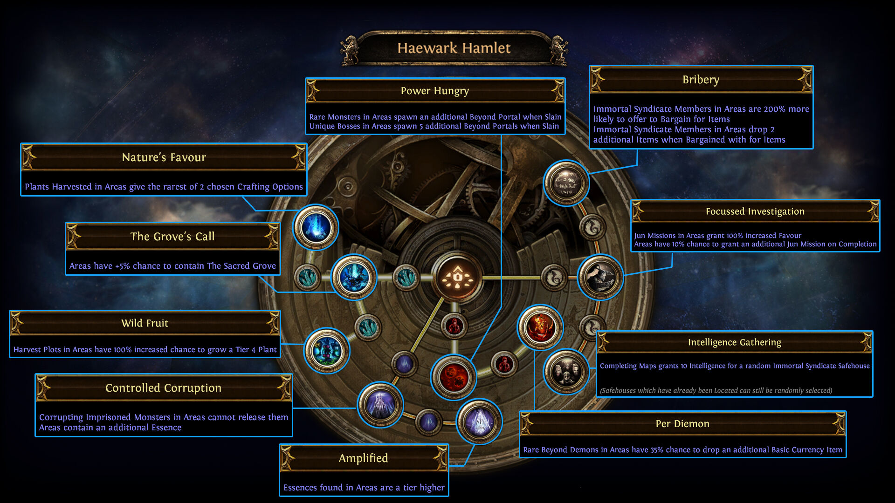
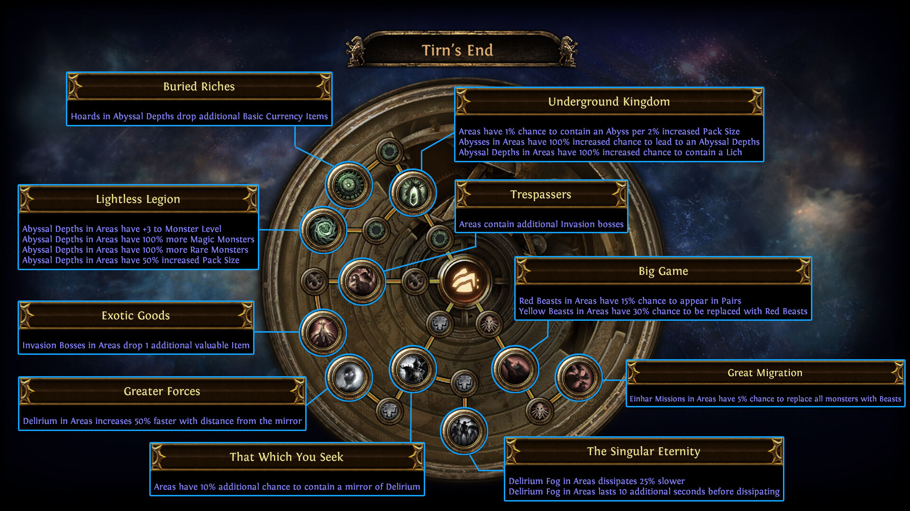
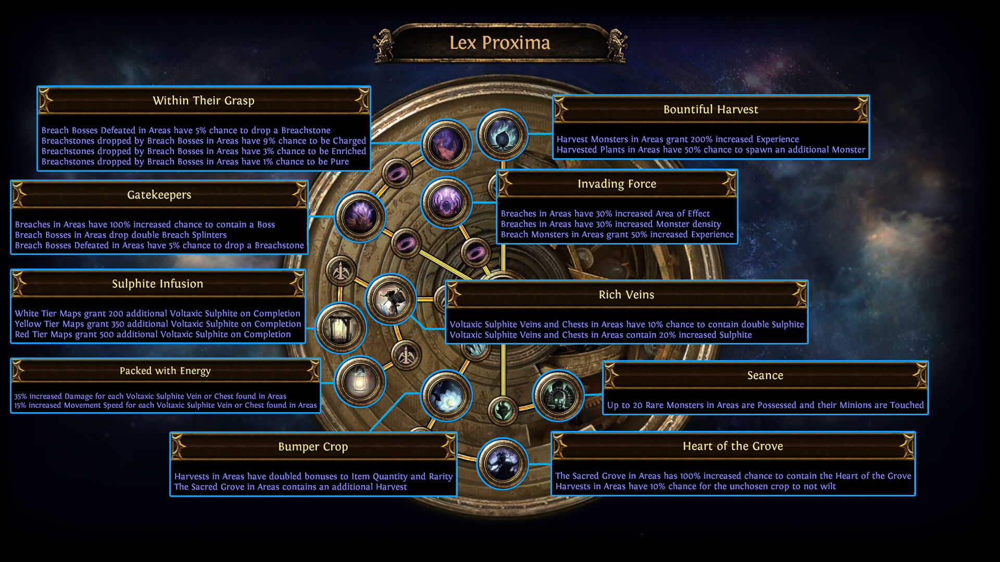
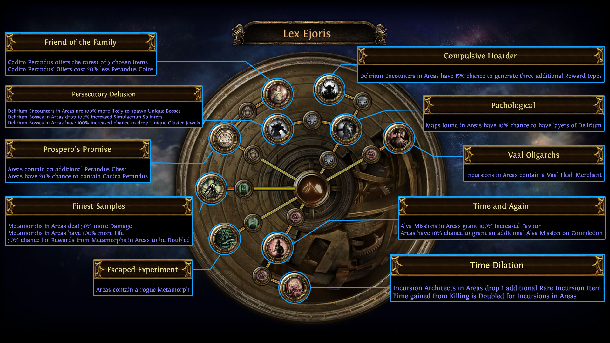
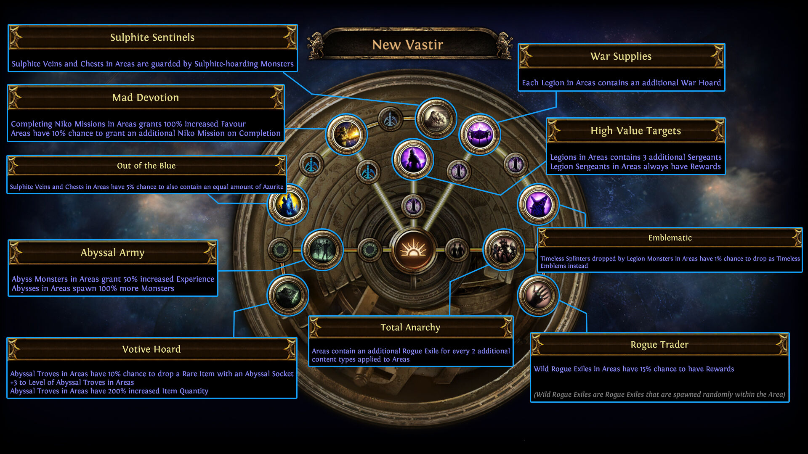
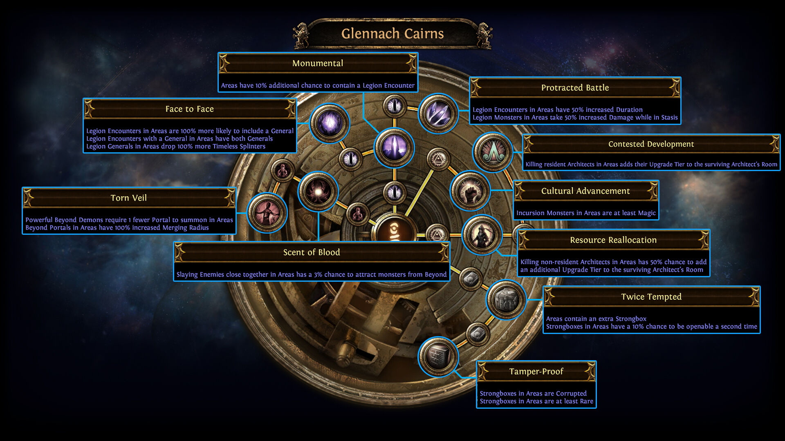
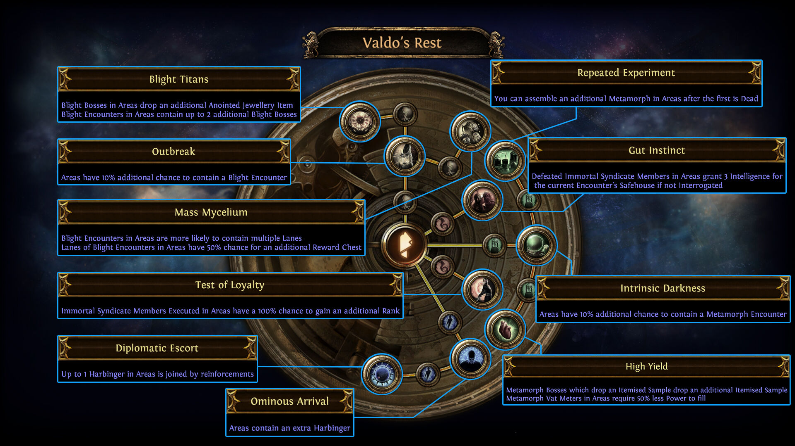
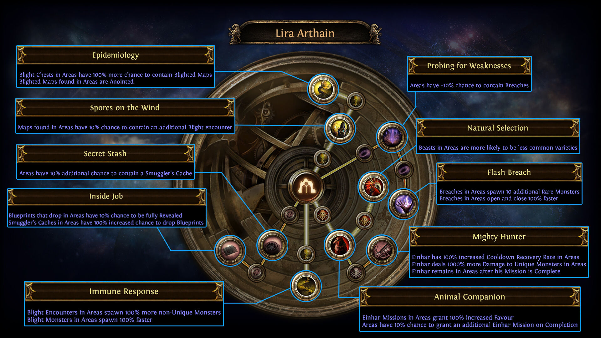

## Map配置

今期はAtlasのMap配置に変更なし！ See: [Link](https://www.pathofexile.com/forum/view-thread/3079980)

> Map Tiers
> Note that there has not been a shuffle of the Atlas for Ultimatum. Map tiers are unchanged from Ritual.

## Atlas Passive変更点

- 自分で見るようなので翻訳とかは無し
- 画像は以前のまま
- 後で、一言コメントぐらいはつけるかも
- 公式ソース: [Link](https://www.pathofexile.com/forum/view-thread/3079973#atlaspassivebalance)

## Haewark Hamlet

- Beyond
    - [Removed] Power Hungry has been removed.
    - [Moved] Per Diemon has been moved to Glennach Cairns.
- Ritual
    - [New] Added two small nodes, which cause Monsters Sacrificed at Ritual Altars in Areas to grant 10% increased Tribute.
    - [New] Added Sacred Lands, which grants +10% chance for Areas to contain Ritual Altars.
    - [New] Added Paid in Blood, which allows you to reroll Favours in Areas 2 additional times, while also granting 100% increased chance of Ritual Altars with Special Rewards.
- Harvest
    - [Buff] The Grove's Call now grants +10% chance for Areas to contain The Sacred Grove (previously +5%).
- Betrayal
    - [No Changes] Clarified that the Bribery Atlas Passive causes 200% more items to drop instead of 2 additional items. This is purely a description change.

## Tirn's End

- Invansion Boss
    - [Minor Nerf?] Exotic Goods now causes a wider selection of Items to drop.
- Bestiary
    - [Nerf] Big Game now has a 15% chance for Yellow Beasts to be replaced with Red Beasts (previously 30%).
    - [Buff] Great Migration now has a 10% chance for Areas with Einhar Missions to contain additional Packs of Beasts instead of other Monsters (previously 5%).

## Lex Proxima

- Harvest
    - [Buff] Small Harvest Chance nodes now grant +3% chance for Areas to contain The Sacred Grove (previously +2%).
    - [Nerf] Bumper Crop no longer causes Harvests in Areas to have Doubled bonuses to Item Quantity and Rarity.
    - [Buff] Heart of the Grove no longer grants 100% increased chance for Areas to contain the Heart of the Grove. It now causes Harvest Bosses in Areas to always drop a Sacred Blossom.
- Torment
    - [Nerf] Seance now Possesses 5 Rare Monsters (previously 20).
- Delve
    - [Buff] Packed with Energy now grants +1% to all maximum Elemental Resistances for each Voltaxic Sulphite Vein or Chest found in Areas.

## Lex Ejoris

- Perandus
    - [Minor Change] Small Perandus nodes now grant a 10% chance to drop twice as many Perandus Coins (previously 20% increased Stack size of Perandus Coins found in Areas).
    - [Nerf] Friend of the Family now causes Cadiro to offer the rarest of 3 options (previously 5).
- Metamorph
    - [Nerf] Escaped Experiment now has a 50% chance for Areas to contain a Rogue Metamorph (previously 100%).
    - [Buff] Finest Samples now causes Metamorphs in Areas to deal 15% more Damage (previously 50%). In addition, it now causes Metamorphs in Areas to have 150% more Life (previously 100%).
- Incursion
    - [Nerf] Time Dilation now causes Incursion Monsters in Areas to be at least Magic Rarity. Incursion Architects no longer drop an additional Rare Incursion Item.
- Delirium
    - [Nerf] Pathological now has a 5% chance to apply layers of Delirium to Maps found in Areas (previously 10%).
    - [Nerf] Compulsive Hoarder now has a 10% chance to cause Delirium encounters in Areas to generate three additional Reward types (previously 15%).

## New Vastir

- Legion
    - [Moved] High Value Targets has been moved to Glennach Cairns.
    - [Moved] Protracted Battle has been added (previously in Glennach Cairns).
- Abyss
    - Votive Hoard now has a 20% chance for Abyssal Troves in Areas to drop a Rare Item with an Abyssal Socket (previously 10%). It no longer increases the Level of Abyssal Troves.
- Delve
    - [Buff???] Sulphite-hoarding Monsters spawned by Sulphite Sentinels are now more dangerous but more rewarding.
    - [Buff] Out of the Blue now has a 20% chance for Sulphite Veins and Chests in Areas to also contain an equal amount of Azurite (previously 5%).
- Anarchy
    - [Buff] Total Anarchy now causes Areas to have a 10% chance to contain 20 additional Rogue Exiles (previously added 1 Rogue Exile per 2 additional content types applied to Areas).
    - [Bufff] Rogue Trader now has a 50% chance for Wild Rogue Exiles to have additional rewards (previously 15%). However, it now causes them to have 200% increased Maximum Life.

## Glennach Cairns

- Legion
    - [Moved] Protracted Battle has been moved to New Vastir.
    - [Nerf] High Value Targets has been added (previously in New Vastir). It now grants Legion Sergeants an additional 25% chance to hold a reward (no longer guaranteed).
    - [Nerf] Face to Face no longer grants 100% more Timeless Splinters from Legion Generals in Areas.
- Beyond
    - [Nerf] Per Diemon has been added (previously in Haewark Hamlet). Rare Beyond Demons in Areas now have a 25% chance to drop an additional Basic Currency Item (previously 35%).
    - [Nerf] Torn Veil now grants 50% increased Beyond Portal Merging Radius (previously 100%).
- Incursion
    - [Moved] Cultural Advancement has been removed. Its effect now appears on Time Dilation in Lex Ejoris.

## Valdo's Rest

- Harbinger
    - [Nerf] Diplomatic Escort now replaces one Harbinger with a King Harbinger instead of a group of Harbingers.
- Syndicate
    - [Buff] Gut Instinct now provides 5 Intelligence for the current Encounter's Safehouse if an Immortal Syndicate member is not interrogated (previously 3).

## Lira Arthain

- Bestiary
    - [Nerf] Natural Selection no longer makes rarer beasts quite as common.
- Blight
    - [Buff] Immune Response now causes Blight Monsters to spawn 150% faster (previously 100%).
    - [Nerf] Spores on the Wind now causes Maps found in Areas to have a 5% chance to have an "Area contains an additional Blight Encounter" Enchantment Modifier (previously 10%).
- Breach
    - [Nerf] Flash Breach now causes Breaches in Areas to open and close 50% faster (previously 100%).

## Uncharted Realms

- [Buff] Neural Pathways now grants a +1% chance (previously +0.5%) for a Synthesis Map to be dropped from Unique Bosses in Tier 14+ Maps (previously Tier 11+).
