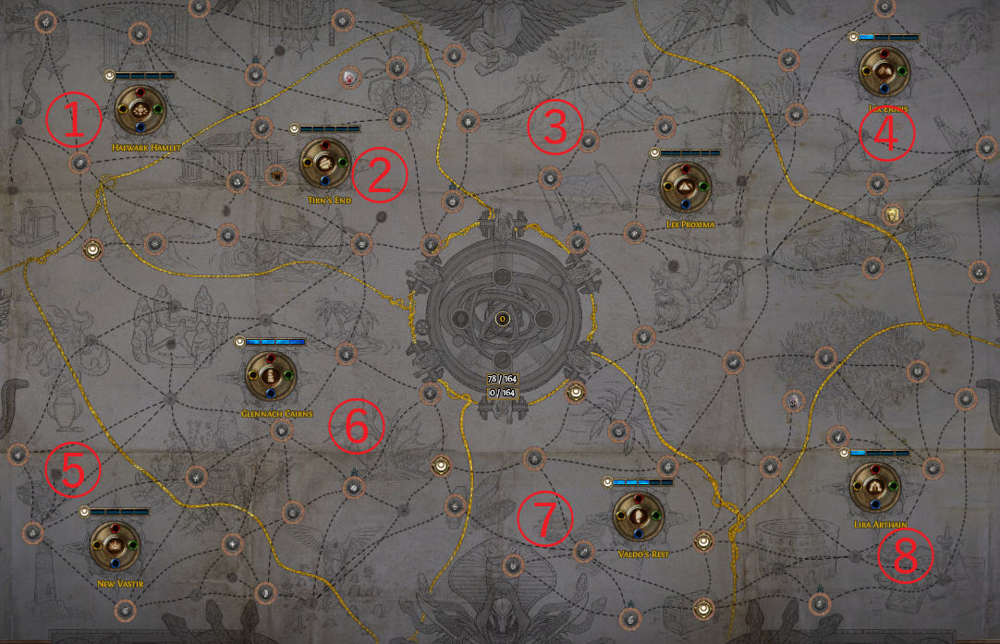

## これはなに？

2/27&28に開催されたHavoc Team Blast Raceに参加したので、そのときの振り返り記事です。

今後、同じようなレースに参加する人の参考になればと思います。

また、パーティープレイでのリーグスタート記事はなかなか無いので「パーティープレイでリーグスタートをキメたい！」といった人向けにも参考になると嬉しいです。

## レース概要

2~6人のグループで、ポイントを競い合うTwitch StreamerのHavoc主催のコミュニティーレースイベントです。

ポイントは↓の表にある通りで、24時間以内にできるだけ多く稼いだチームの優勝です。

- League: Ritual SCベースのプライベートリーグ
    - [Private League Link](https://www.pathofexile.com/private-leagues/league/Havoc+Team+Blast)
- 公式Info
    - [Link](https://docs.google.com/spreadsheets/d/1PhvJRVymW9FVSQbNxKxxkiLlG3SX9qvnv04dp7mseus/edit#gid=0)
- ルール:
    - 人数: 2~6人
    - パーティー内でのアイテムの共有可
    - 6時間 x 4の途中休憩ありの合計24時間の4Quarter制
    - **配信必須**
- 日程:
    - DAY1: 2/27
        - Q1: 10PM - 4AM
        - Q2: 5AM - 11AM
    - DAY2: 2/28
        - Q3: 10PM - 4AM
        - Q4: 5AM - 11AM

### 公式Tweet



### 公式宣伝YouTube動画



## チームメンバー紹介

チームメンバーは、以下の4人でした。

使用スキルはBlade Blastで統一しました。

SCの24時間のGroup FoundレースではAura Botは不要で、その分マップを回る人を増やしたほうがいいです。

|           | Build                  | Role          | Acount                                                               | Twitch                          | Discord ID     | Twitter ID* |
|-----------|------------------------|---------------|----------------------------------------------------------------------|---------------------------------|----------------|-------------|
| bannyang  | Occultist Poison BFBB  | Utils + Delve | [profile](https://www.pathofexile.com/account/view-profile/bannyang/characters) | [twitch](https://www.twitch.tv/barnyang)  | Barn#7562      | [@ukesiburn](https://twitter.com/ukesiburn)  |
| hsdf      | Elementalist Fire BFBB | Farmer        | [profile](https://www.pathofexile.com/account/view-profile/hsdf/characters)     | [twitch](https://www.twitch.tv/hsdff)     | hsd#5284       | [@hsdf_hsdf](https://twitter.com/hsdf_hsdf)  |
| gaijinlag | Assassin Poison BFBB   | Farmer        | [profile](https://www.pathofexile.com/account/view-profile/gaijinlag)           | [twitch](https://www.twitch.tv/gaijinlag) | gaijinlag#3720 | [@gaijinlag](https://twitter.com/gaijinlag)  |
| ryzenier  | Elementalist Fire BFBB | Boss Killer   | [profile](https://www.pathofexile.com/account/view-profile/ryzenier/characters) | [twitch](https://www.twitch.tv/ryzenier)  | ryzenier#5308  | [@ryzenier](https://twitter.com/ryzenier)   |

## 目標＆結果

早速ですが、今回のレース結果です！

事前練習から、時間的にUber Elderは厳しそうだったので、それ以外の全ボスとDelveは300層、平均レベルは94で116ptを目標にしました。

本番では、平均レベルが94→95で1pt増えて、117ptでした。Vald's RestのSyndicateファームでSafehouse（=100% inc exp）を共有しまくったのがデカかったです。

チームの最終順位は、8位で一応インマネしました！！！ :tada: （$116を4人で山分け :moneybag: ）

レース後にTweetもしましたが、無理だと思っていたUber ElderもFragmentガチャの運が良ければいけそうでした。



自分たちの上には、レース常連の人たちしかいなかったので、そこそこ健闘できたかな、という感想です。

---

ここからは、レース前の練習の振り返りと、具体的にどんな戦略を立てたのか、他のチームはどうだったのか、という振り返りです。

## 事前練習

練習は、本番の10日前の2/17から初めて、平日はだいたい22:00～3:00、土日は10時間ほどチームで練習しました。

## 事前の戦略と振り返り

### Act進行

Actの進行方法は、やることが多く、全てをここに書くのは難しいことと、既に良いドキュメントがあるので、こちらを参考にしてください。

- [ShakCentral's Group Progression](https://docs.google.com/document/d/1s_riAfRTRVEavfPIlNRI4ekirpjLg8QeSuRDB9E4n54/edit)

Act5で2時間以内、A10で4時間以内を目安に練習するのがいいと思います。
やってみて思ったのは、パーティーで進行したからといって、ソロで走るときと比べて劇的に早くなる、とかはないってことです。
結局のところキャリーする人のタイムに依存します。

### 各ボスを倒すまで

- Uber Atziri
    - Vald RestのSyndicateファームで[Sambodhi's Vow](https://pathofexile.gamepedia.com/Sambodhi%27s_Vow)のカードを集める
    - Wild T3: Sacrifice a Red Map to create random Map Fragments based on its tierで入手
    - Atziriを倒す（1周約3~5分程度でドロップ率40%ほど）
    - Primal T2: Change a Sacrifice or Mortal Fragment into another random Fragment of that typeで変換

=> 畑でFragmentの入手と変換ができるので、思いの外簡単に集められます

- Maven
    - 10ボス（1~2個）、ガーディアンラッシュ（3~5個）でCrescent Splinterを集める
- AL8 Sirus
    - Sirusを湧かすのに石20個 => AL+5
    - Vald's RestのCraftable Watchstone4個 => AL+1
    - Atlas 中央Passive => AL+1
    - 未回収の外周の石、ガーディアンラッシュでVald's Rest以外のCraftable Watchstone、Maven&SirusのUnique石 => AL+1

=> どちらもガーディアンラッシュに行くのが近道です

=> **なるはやでT14+に到達し、マップを回しまくることが重要です！！！**

### Atlas進行

エリア名だとわかりづらいので、以降は↓の図のように番号①～⑧で解説します。

また、Atlasの石集めのテンプレ進行を理解していることを前提に書くので、まだの人は、コチラの素晴らしい記事を参考にしてください。

- 英語: [Conquerors Atlas Guide for 3.11](https://balormage.com/atlas-guide/)
- 日本語訳: [3.12 Conquerors Atlasガイド](https://balormage.com/atlas-guide-japanese-translation/)

内側の石を回収する順番は、②→⑦→③→⑥にしました。

#### Map入り直後

1. 各々KiracからT1をもらた後、T1 Covesを買って3枚売りのVendorレシピでT2 Wharf (※1)を作ってギルスタに入れる
1. リーダーがギルスタのT2 Wharfを回収しT3 Mapを作る
1. T3マップにいってZanaを湧かす(※2)

Map入り直後は、なるべくはやくT3 Mapに行き、Zanaからマップを買うことでMapプールを増やすことが重要です。
普段のSSFのリーグスタート時は、T2までしか作ることができませんが、今回はパーティーなので、即T3を作ってZanaを湧かせるようにしました。

- ※1: T2をWharfにしている理由は特にありません。メンバー間で統一できていれば他の②のT2でもOKです。
- ※2: ②の地域でT3を作るのは、最初に石をはめるのが②だからです。（内側の台座は、各領域でT3以上のマップボスを倒したときに必ず手に入り、パーティーで共有できます）

#### 外周石集め Watchstone: 1-4

1. 各々zanaからマップを買う
    - このとき、事前に四隅を分担しておき、自分の担当以外のマップはギルスタに入れて担当の人に渡す
    - 本番は①: ryzenier、④: hsdf、⑤: gaijinlag、⑧: bannyanで分担
2. 担当のエリアでBaranを倒したら②に石をはめ、余ったマップをギルスタに入れる
3. ギルスタから四隅のマップを回収して、時計回りで残りの外周の石を回収する

Zanaが初めて販売するマップは、以前は固定でしたが、いつからか固定ではなくなりました。
自分の担当領域が売っていなかったら、内側のT1~3を回ってAtlas Bonusを共有しつつ、↓の方法で無理やり手に入れます。

- 余ったT4、T5にHorizon Orbを使う
- ZanaのMaster Missionを入手したら速攻で使い、店売りを更新

担当領域のBaranを倒すまでは、他の外周の領域は絶対に回らないようにしましょう。

この方法は、トレードリーグであれば、事前に相談して担当領域を決めておくだけで、簡単に再現できるので、おすすめです！

マップは↓みたいな感じで、地域ごとにギルスタの四隅に置いておくとわかりやすいです。

#### Watchstone: 5-8 & 13-16

特に工夫する点はなくひたすらマップを回るだけです。

#### Watchstone: 17-20

今季はVald's Restがマップ維持＆Syndicateファームするにあたり、めちゃくちゃ美味かったこともあり、最後の内周の石はボスキル役（ALを8まで上げる必要がある）以外は、回収しませんでした。

後は、ひたすらマップを回して、ガーディアンマップを入手するだけです。

## [WIP] 他チームの戦略

WIP

## 感想

最後に、今回一緒に参加してくれた、ばーんさん、はすどさん、らぐさん、ありでした！ｗ