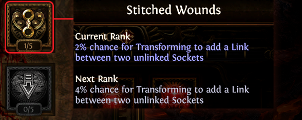
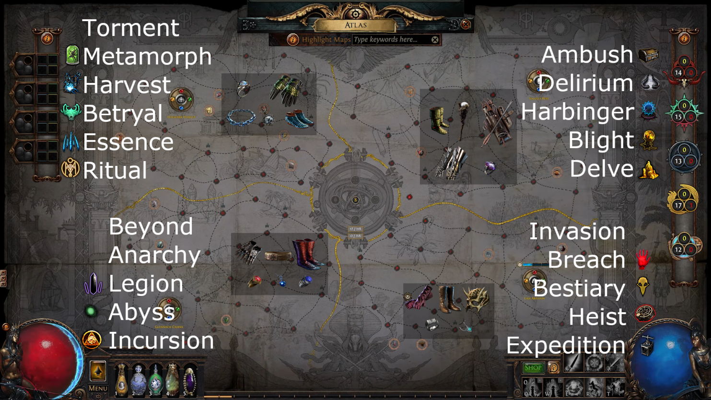
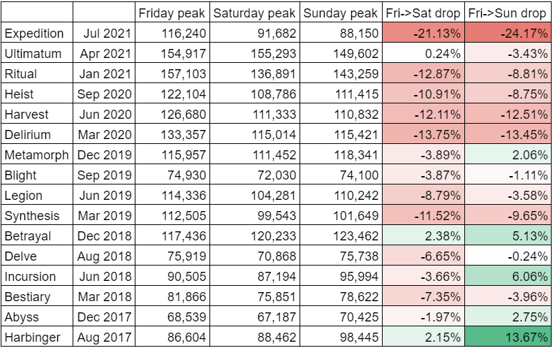

来期のパッチノートが出たというのに今更3.15 Expeditionの振り返りｗ

## リーグスタート！

557とそこそこの順位でスタート！戦いはここから始まっている。



## Raider Trinity Lightning Strike

前期フレンドがやっていて強そうだったのでRaider Trinity Lightning Strikeでスタート！

サポジェムが大幅Nerfされたが、Lightning Strikeの基礎ダメージが1.56倍されていて最終的なDPSは前期とほとんど変わらないず、むしろ1リンク分の価値が下がったことで、5Lでの火力が上がっているのが高評価！



FlaskのNerfとFlame Dash&Smoke MineのCD増加の影響もRaiderの常時OnslaughtとWhirling Bladesで感じないのも良き！
弱体化されても使うけど、ガチでSmoke Mine返してくれーｗ



マップ入り直後は、火力低くて結構苦労した。。。ただ、その分めちゃめちゃ固くてファームでは絶対に死なない感じがした。
RaiderのEvade&Dodge強すぎｗ



リーグ要素は経験値効率落ちるので一切触らず、Grand Heistで6L入手！



SSFだと、HarvestかTirn's Endの「Invasion Bosses in Areas drop 1 additional valuable Item」で5L入手からの「Enchanted Armaments」のGrand Heistで6L入手が一番早いと思う。
体感だけど、Area Level: 68-75ぐらいの低層の方が6Link系（素6L or All Sockets Linked）が出やすい気がしている。

後は、CorruptedになっちゃうけどGlennach CairnsのStrongbox+1と「Strongboxes in Areas are Corrupted」の組み合わせもいいんだけど、今期のAtlas進行的にGlennach Cairnsは内周の最後に石回収する都合上、やらなかった。

（ちなみに、次リーグでは、Atlas周りの大きな改修があり、AmbushはHarbinger、Blight、Delve、Deliriumと同じエリアなので優先して取るかと言われると微妙ｗ
InvansionもHeist、Bestiaryと競合しているので無し。頼りのリーグ要素はImplict Modを追加する感じで期待できないので、5L、6Lは素直に畑とGrand Heistで狙うのが良さげ。）

**【追記】**
と思っていたらScourge Passive Skill Treeに"2% chance for transforming to add a link between two unlinked sockets"というのがあり、5pt振り切ることで最大10%まで伸びるらしい。
3回までTransformできるから、確率的には `27 [%] (= 1 - 0.9^3)` で2 link追加！
SSF的には、Essence等でLife + 2 Res + Craftみたいな胴体を適当に作ってチャレンジするのが良さげ！
**【/追記】**

- ref. [Scourge mechanics interesting for 6 linking items ?](https://www.reddit.com/r/pathofexile/comments/q99651/scourge_mechanics_interesting_for_6_linking_items/)

- ref. [Scourge Atlas Base and Passive For Each Region [fixed]](https://www.reddit.com/r/pathofexile/comments/q8hvho/scourge_atlas_base_and_passive_for_each_region/)

そんなこんなで、4日目時点でレベル97の総合4位！



ただ、このあたりからリーグ要素がガチで面白くないのと、次やりたいビルドがなくてモチベがダダ下がり・・・ｗ







周りを見ても軒並みDaily Activeが減ってて、このリーグガチでゴミだなあって思ってた。



後は、マップが全然ドロップしないのもストレスだった。



（これはかなり眉唾ものではあるんだけど、GGGがリーグ開始1週間はマップドロップ率を下げてる説があって、SSFSCガチ勢の友人曰くそんなことはないって言うんだけど自分は絶対にやってると思ってる。特に、ここ最近のリーグでは！勿論、内部的に[Map Drop Equity](http://www.vhpg.com/map-drop-equity/)ってのが存在していることは知っているんだけど、そんなんじゃ説明できないほどにドロップ率が違うと思う。一応、個人の感想なので、信じるか信じないかはあなた次第。）



んで、このタイミングで、流行病のワクチン接種2回目に行ってきた。



自分は、モデルナだったからか副反応が結構キツくて翌日から熱が出始めて、下がるまで丸3日かかった。（土曜日の夕方に摂取して火曜日まで寝込んでた。）

当時のtweet↓。これから摂取の人は、ガチで舐めないほうがいいので気をつけて！






ワクチンから復帰するも、当然モチベは上がらずダラダラとファームを続けてた。



本当にモチベが上がらなくて、弟と通話したり、Twitchで久しぶりに配信してみたりした。





そんなこんなでダラダラファームを続けるも、レベル99なりたての全体11位で幽霊DD RIPｗ（何故かバグでRIPログが流れてない）

幽霊DDはファーム速度を下げるぐらいしか対策のしようがないし、本当にしょうもないから消して欲しい。



次のビルド何やるかとStashを見ていたらSoul Mantleがあったのでfusing打ったら繋がった。



ただ、本当にリーグ要素がつまらなくて結局何もせず、このままフェードアウトした。



## まとめ

結果的に、2.6 Legacy以降、過去一番プレイしなかったリーグになってしまった。順調にRaiderがレベル100になっていたとしても次のキャラはやらなかったと思う。

自分以外にも、そう感じたプレイヤーは多かったようで、3.0以降圧倒的な離脱率を記録したらしい。

- ref. [Opening weekend playerbase comparison of all PoE leagues since 3.0](https://www.reddit.com/r/pathofexile/comments/orjyf7/opening_weekend_playerbase_comparison_of_all_poe/)

## 結局、何がいけなかったか？

個人的にはSmoke MineのNerfが本当に痛かった。

**プレイ速度**を落とすための変更だと思うが、いくら**ゲームの進行速度**を落としたいからといって、プレイフィールまで落としてしまうのは、反対。
正直、Smoke Mineが返ってくるまでASの稼ぎづらいTemplar、Witch、Shadowはやりたくない。そういうレベルで移動が遅い。ビルド選択の幅を著しく下げているので、さっさと戻して欲しい。

一方で、サポートジェムをNerfに関しては、割と好意的。

最上位プレイヤーのパーティーだと、24時間以内に全ボス撃破できてしまえたので、**ゲーム進行速度**を落とす意味合いで正しい。（これは実際にHavoc Team Blast Raceに出てみての感想）
勿論、HCだとより難しくなるが、GGGはSCトレード基準で調整しているらしいので、妥当な判断。

と、思っていたが来期は、Atlasの領域を8=>4に、マップ数を164=>118にするらしいｗ サポジェムNerfで遅らせた**ゲーム進行速度**も一瞬でひっくり返るレベルの大きな変更ｗ
来期、開始何時間でUber Elderが倒されるのかが今から楽しみｗ