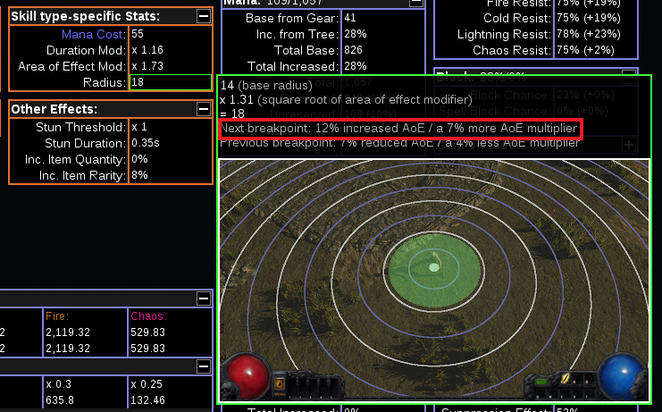
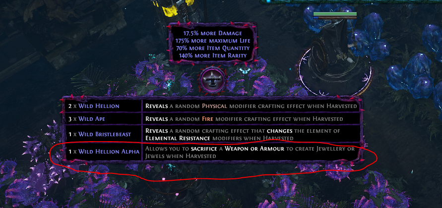
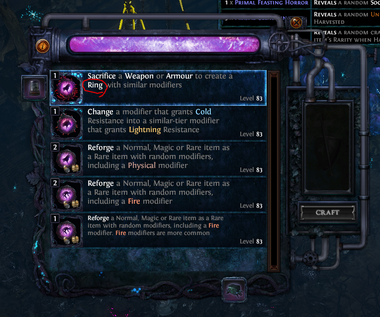

## 導入

前々から気になっていたので、短期のイベントリーグでプレイしてみた感想。

3.19のバランスマニフェストも公開されて比較的nerfを受けなかったビルドとしてOcc Poison BFBBが気になっている人向けの参考になれば幸い。

SSF向けにギアの作り方も、まとめたので参考にしてもらえるとありがたい。

## 参考にした動画・ninja・PoB

- [YouTube - GucciPradas - Poison BFBB Guide](https://www.youtube.com/watch?v=OB-JRhPSPzY&ab_channel=GucciPradas)
	- 「HC Tradeリーグで、ギチギチにギア詰めました！」って感じのバージョン
	- End Game PoB: https://pobb.in/Il8wgdiFQAh5
	- Cluster未使用のlow level PoB: https://pobb.in/d9Dxth8-Zszn
	- SCでやる場合のPoB: https://pobb.in/IM6oz9HnUX9y
- [YouTube - dslily - Poison BFBB Guide](https://www.youtube.com/watch?v=MEA77vVjbw4&t=1187s&ab_channel=dslily)
	- 「SSFHCでビルド紹介動画のためにお試しで作ってみたよ～」ぐらいのバージョン
	- PoB: https://pastebin.com/Cd7stpUH
- [YouTube - シンスカイ(Sinsky) - Sentinel Poison BFBB SSFHC Maven Kill](https://www.youtube.com/watch?v=fJr-J5sZLio&ab_channel=%E3%82%B7%E3%83%B3%E3%82%B9%E3%82%AB%E3%82%A4)
	- YouTubeでたまたま見つけた日本人っぽい人。Maven以外の動画もあるので参考になる。
	- ↑2つとは違ってTemplarのAuraノードまで取りに行く形
	- [poe.ninja](https://poe.ninja/challengehcssf/builds/char/kutyutoshi/Sinsky_PBB?i=2&search=class%3DOccultist)
- [YouTube - imexile - 毒瓶レベリング（Act 10まで） Time: 3:57:31](https://www.youtube.com/watch?v=18jeWRSP76M&t=11114s&ab_channel=Imexile)
	- 毒瓶レベリング
- 自分のやつ
	- 短期リーグで作ったバージョンのPoB: https://pastebin.com/hB4VVQNq

## メリット・デメリット

- メリット
	- フェイスタンクできる格下相手に鬼のようなDPSを叩き出せる
		- Uberボス以外は全てフェイスタンク可能
	- Curse爆破とPlague Baererがあるため2キャストスキルでありながら、そこそこファームが早い
	- 3.19のバランス調整の影響を、そこまで受けない（または対処法がある）

- デメリット
	- Mana問題がめちゃくちゃキツイ
		- Amulet、Ring全箇所に-7 Mana Costのクラフトをした程度では全く足りない
	- Uber Bossなどフェイスタンクできない相手にはDPSがめちゃくちゃ下がる
		- かなりギアを詰めないと倒せないレベル。HCだと、ほぼほぼ無理。
	- life gain hitのring/WEが手に入るまでlifeサステインに難あり
	- 2キャストスキル
		- 操作量が多いのが嫌いな人は避けたほうが吉
	- 行けないmodがやや多い
		- No Reg/Reflectに加えてAvoid Poison/Less Curse Effectも行けない
		- HCでDamage Modを避けるとマジでmagicしか回れない
		- 検索用: `"as h|n m|ces|bom|f p|e,|je|ln|ev|-"`
	- リーグスターターの場合、毒瓶からの移行が非常に遅い（Lv96で転生した）
		- トレードリーグならもう少し早期に転生できるかも
		- 総じて、毒瓶やってたけど、ボス倒すのキツすぎるって人が転生先に選ぶビルド

## ワンポイントアドバイス

「火力が足りないなあ」と思った場合、まずは防御面を強化してフェイスタンクできるようにしたほうがPoisonのスタック数が稼げて結果的にDPSが上がる。
「火力を盛るのはフェイスタンクできるようになってから！」を大原則にしたほうが良い。

## BFBBについて

Blade BlastはBladefallで地面に刺さったBladeを爆破させてダメージを出す2キャストスキル。
Unleashをリンクさせない状態でPvPで検証すると大体10~15hitほどするので、PoBでは「10 Blades」の「Total DPS inc. Poison」を参考にするのが良い。



ただし、「Total DPS inc. Poison」は、Poison Stackが最大まで溜まるまで（=このビルドだと大体5、6秒間）フェイスタンクし続けたときのDPSなので注意（PoisonビルドがDPS詐欺しやすい所以）。

Physical Masteryの「Skills that leave Lingering Blades have 20% chance to leave two Lingering Blades instead of one. Skills that leave Lingering Blades have +10 to Maximum Lingering Blades」は、BFで地面に刺さるBladeの上限を上げるとともに、残るBladeの数も20%上げてくれるので、必ず取得する。

## ダメージの盛り方

BBはoverlapさせることができるタイプのスキルなのでAoEを盛るのが重要。
PoBの、「Calcs」の「Skill type-specific Stats」で現在のRadiusと次のBreakpointが分かるのでできるだけ盛るのが吉！

一方で、globalのinc AoEだとBFのAoEも上がってしまい集弾性が下がるので、BBのみinc AoEを稼げるのがベスト。

BBに、inc AoEをリンクしつつ、頭のlabエンチャでinc 24% AoEを付けるのが強い。
逆に、BFは、lv.1で止めてmanaコストを減らしつつ、Spell Cascade lv.1、Conc. EffectでLess AoEして集弾性を上げる。Anomalous Conc. Effectがあると更にLess AoEできる。Awakened Spell Cascadeは集弾性が下がるので不要。

その他PhysicalベースのPoison型なので、下記で火力を盛る（ざっくり優先度順）。

- All/Physical Gem +1
	- 言わずもがな。最優先で積む
- Poison Chance
	- 100%必須。Chance to Poisonサポジェムで40%、Treeで50%、Chaos DoTのMediumにつくSeptic Spellsで20%。その他、JewelのModにも5% Chance to Poisonが付く。
- Poison Duration
	- Poison Masteryのinc. 20%と頭のVeiled Modのinc. Ailments Duration while Focusが強い
- inc Wither Effect
	- CorruptionとChaos Masteryのみ。両方とも取ると15 stack時に90%→139% Damage Takenと50% more近くダメージがあがる
- Physical Damage as Extra Chaos Damage
	- MediumのCrit ClusterにCrit時に10%でUnholy Might（30% Physical Damage as Extra Chaos Damage）があるのでSuppression Masteryのinc. 100% Crit Chanceと合わせて取るのがおすすめ
- Chaos DoT Multi.
- inc. Cast Speed
	- 主にWandで盛る。できればRingにもつけたい。
	- Ranger方面に伸ばす都合上、Profane Wandの要求int 237がギリギリなので、ひとつ下のHeathen Wand (+10% CS)がベスト
- inc. Physical/Chaos damage
- Poison Deal Faster
	- 表記上のDPSは上がらないがMAX DPSに到達するまでの時間が短くなることでフェイスタンクできない相手に対して実質DPSが上がる

## Mana問題

BFBBを使う上で切っても切り離せない問題。

BBが61 ManaのCast Rateが3.5+ [casts/s]、BFも49 ManaのCast Rate 3.0+ [casts/s]とバカ重い。

OccでLifetap運用はやや厳しいので、Manaコストを下げつつ、Mana Reg.を稼ぐ必要がある。

主に、

- Ring、Amuletのマナコスト減クラフト
	- 3箇所ほぼ必須
- Veiled ModのFlat Life + Mana Reg.を付ける
- Replica Conqueror's Efficiency
	- -9 Mana Cost
- Clarityを貼る
	- 15% Mana Reservation Efficiencyが削除されるのでキツイ
	- WEのマナコスト減と合わせると吉
- Jewelの「5% reduced Mana Cost」
	- Ring、Amuletのマナコスト減の前に計算されるので、そこそこ減らせる。

で、対策することになる。

## ジェムリンク

- Body:  -  -  -  -  - 
	- Chance to Poison以外AwakenedにできるとかなりDPS盛れる
	- Awakened inc AoEのArea DamageではPoisonダメージがスケールしないので優先度低
- Helmet:  -  /  / 
	- Poacher's MarkはFC生成用
- Glove:  -  -  -  - 
	- BFのManaコストを下げるためにlv. 1で止める。Spell CascadeもLess AoEのためにlv. 1で止める。
	- Anomalous Conc. Effectで更にLess AoEできる
- Boots:  -  -  / 
	- Chaos DoTのMedium ClusterでEternal Sufferingを付けてを外してを付けるのもあり
- Wand:  -  / 
- Shield:  -  / 

## クラフト指南

頭に☆マークを付けたのがビルドをやる上で最低限、必要となる装備。

### ☆ Wand

#### Level 1: +1 Physical Gem + CS + inc. Chaos Damage / Chaos DoT Multi.

- Step 1: 適当なキャラ作ってilv:2のwandをAct 1で買う
- Step 2: +1 Physical Gemが付くまでCast SpeedのEssenceでスパム（成功率: 約1/29）
- Step 3: Suffixが空いていたらChaos DoT Multiを、Prefixが空いていたらinc Chaos Damageをクラフトする

#### Level 2: +1 Physical Gem + CS + inc. Chaos Damage + Chaos DoT Multi.

- Step 1: Level 1で、Prefixの空きが1個、Suffixの空きが2個になるようにAnnulする
- Step 2: Multi Craftでinc. Chaos Damage or Gain Extra ChaosとChaos DoT Multi.をクラフトして完成

#### Level 3: Level 2をHeathen Wandベースで行う

ilvが上がるので+1 Physical Gemが付きづらくなる。

SSFだと、Level 2で十分だと思われる。ガチガチに装備詰めたい人向け。ぶっちゃけ趣味レベル。

+1 Physical GemとCS or Chaos DoT Multiが付くまでReforge Physical/Caster/ChaosしてからMulti Craftしたほうが期待値高いかも。

#### Level 4: +1 All Gem + +1 Physical Gem + CS + inc. Chaos Damage + Chaos DoT Multi.

畑のAug. Physical必須。トレードリーグ用。

- Step 1: Prefixに+1 All GemのみついたRare Wandを用意する
- Step 2: SuffixにCannot Roll Attack Modを付ける。Suffixが埋まっていなければMulti Craftで埋める。Step 4でPrefix Cannot Be Changedが必要なので、Suffixが空の場合、この時点で付けるのがベスト。
- Step 3: 畑のAug. Physicalで+1 Physical Gem確定
- Step 4: Prefix Cannot Be ChangedをつけてScorgingして+1 All Gemと+1 Physical GemのみのRareにする。
- Step 5: Multi + Prefix Cannot + Suffix CannotをつけてVeiled Orbを使うとSuffix確定。Chaos DoT Multi. or CS引けたらStep 6へ。引けなかったらStep 4へ。
- Step 6: MultiでCS or Chaos DoT Multiとinc. Chaos Damage or Extra Chaosをクラフトして完成

### Shield

盾は他の部位で稼げないMax ResとPhysical Damage Reduction、Reduce Extra Damage from Critを稼ぐ。
PrefixにCraftできる8% Extra Chaosが強い。

Suffixが埋まった状態でHunter Ex打つとinc %Life確定、Warlord Exだとinc. AoE確定。

- 畑のReforge Physical/Fire/Cold/Lightningで高Life + PDR or Max Resを引く
- ExpeditionのRogクラフトで高Life + Max Res + PDRを引く
	- 結構な確率で持ってきてくれるので面倒くさくないならおすすめ

### ☆ Helmet

Suffixのinc Ailments Duration while Focusを必ずクラフトする。
LabでBBのinc 24% AoEエンチャがつけられるとベスト。

Eldrich Implicitは、

- Eater or World: reduce Shock Effect、inc Ailments Duration、Mana Reservation Efficiency
- Searing Exarch: Despair Curse Effect

### ☆ Glove

ベースはFaster Castingが付くのでShaperベース確定。
Reforge Casterで高確率で付くので高Lifeが付くまでガチャ。

Uniqueだと以下がおすすめ。

- Wyrmsign: Conc. Effect付き。Rampageの起動には別途ECを生成する手段が必要。

- Kalisa's Grace: Faster Casting付き。

### Boots

畑 or EssenceでSuffixを3つ作ってからSuffix Cannot Be ChangedからのVeiled OrbでMS + Chill無効が引ければ完成。

Eldrich Implicitは、

- Eater or World: Extra Chaos
- Searing Exarch: Action Speed

### Body Armour

畑 or Essenceでこねる。

Eldrich Implicitは、

- Eater or World: Determination Aura Effect
- Searing Exarch: non-Curse Aura Effect / +1 Max All Res

3.19で胴体につくSupression Chanceが減少しGain Extra ESのクラフトが消えたので、ユニークのDendrobateも、あり寄りのあり。
Chance to Poisonが不要になりCruelty or Empowerと差し替えられるのは単純に強い。
付帯効果の25% inc Poison Durationは簡単に条件を満たせるが、inc 100% Damage with Poisonの方はDex300稼ぐ必要があるので厳しい。

### Belt

Hunter or ElderベースにReforge Life。

Uber Uber Labでつけられる「Enemies Withered by you have -6% to all Resistances」がクソ強いので最終装備ができたら必ず付ける。

### ☆ Hunter Ring w/ Despair on Hit

HunterリングにDespair on Hitが付くまで畑でReforge Caster。
Suffixが完成したらSuffix Cannot Be ChangedからのVeiled OrbでMana CraftしてからUnveilすることで、超高確率でLife + Mana Regをつけられる。
Prefixに-7 Mana Costをクラフトして完成。

### ☆ Shaper Ring w/ Life Gain Hit

ShaperリングにLife Gain Hitが付くまで畑でReforge Caster。
有要なSuffix 2つが複合したらMulti CraftでLife + Mana Regと-7 Mana Costをクラフトして完成。

### Amulet

AnointはWitherのEffectが35%上がるCorruption（Black、Black、Crimson）が最強。

Chaos DoT Medium Clusterがなくて100% Chance to Poisonにできない場合は、Toxic StrikeをAnointするのもあり。

#### Level 1: +1 Physical Gem + DoT Multi.

- Step 1: ベンダークラフトで+1 Physical Gemを適当な武器に付ける
- Step 2: Chaos DoT MultiをクラフトしてRegal Orbでレア化する
- Step 3: 畑のWeapon → Amulet変換に突っ込むと、そこそこな確率で+1 Physical GemとGlobal Dot Multi.のついたAmuletができる（短期リーグで試して3/7）
- Step 4: Prefixが2つ空いていればMulti CraftでLife + Mana Regと-7 Mana Costをつけて完成。空いていなければ、Life + Mana Regのみクラフトして一旦完成。

畑のWeapon → Amulet変換は「Wild Hellion Alpha」から入手可能。

「Belt、Ring、Amulet、Jewel」の4パターンある（画像はRingバージョン）。

#### Level 2: Ashes of the Stars

結局、これが一番強い。

+1 all Gemは言わずもがな、QualityでBBのinc. AoE、Temporal ChainのCurse Effect、VMSのDuration、Plague Bearerのinc AoE、Defiance BannerのAura Effect、Anomalous Withering StepのWither Stack数が上がったりと恩恵がデカい。

Masteryから15% Mana Reservatin Efficiencyが消えたことで更に有要性が上がった。

### Physical Large Cluster

3 notableが引けるまで畑のReforge Physical。

Prefixは、Battle-HardenedとMaster the Fundamentslsがベスト（OverwhelmはPoison型だと意味無し）。

Suffixは、Grim Oath（10% Extra Chaos）がベストだが、飛び抜けてweightが低いので、Furious Assault（25% inc Physical + 8% CS）でも可。

### ☆ Chaos DoT Medium Cluster

Septic Spells（+20% Poison Chance）が必須。caster tagがこれのみでreforge casterでほぼ確定なので厳選が容易。

もう一つは、DPS的にはCircling Oblivionがベストだが、Eternal Suffering（Witherが5スタック以下の場合50%の確率でWither付与）だとWithering Stepが不要になるので、こちらも有り。

Septic Spellsがilv>50、Circling Oblivionがivl>1、Eternal Sufferingがivl>50なので、ilvが68未満50以上のmediumでこねると少しだけ楽に作成可能。

### Crit Medium Cluster

Overwhelming Malice（Crit時に10%の確率でUnholy Might）が必須。
1 notableで20-30% more相当の価値があるので、これだけついていれば問題ない。その場合は、5pだと奥のソケットを取るのに1pt余分に必要になるので注意。

tag無しでweightが171と、低いので地道に不要な畑でReforgeするかAlt Spam、Chaos Spamで狙うしかない。
畑Reforgeする場合、Fire/Cold/Lightningだと不要なEye of the Stormがついてしまうので、それ以外でReforge推奨。

## 3.19での影響

現時点(8/8)で分かっているもののみ。

### 胴体のGain Extra ES Craftの削除

ESが約700ぐらい下がる（Vanity有りで1.2k、無しのEV/ES胴で800ほど）。
Ghost Danceの回復量（EV20kの3%で600回復）に比べてESがやや高すぎた(=Vanity込で2k+)説があるので、ワンパン耐性は下がるが、そこまで重大な影響はないかなあといった感想。
Vanity無しでもES/EV胴を着れば余裕で600超えるので問題なくGhost Danceを運用できるかなといった印象。

後述のSpell Suppression Nerfと合わせて、胴体にDendrobateを採用しやすくなったのも逆に考えるとバフ。

### Spell Suppressionの調整

3.18では、Inveterateで30%、胴T2で31%、靴T1で22%、Instictで18% or 頭 or 手で17%で100%を実現していた。

3.19では、

- Inveterate: 30% → 39%
- Instict: 18% → 22%
- 胴盾: T1で34% → 22%、T2で31% → 19%
- 頭手靴: T1で22% → 14%、T2で19% → 12%

候補としては、ギア要求が低い順に、

1. Inveterateで39%とInstictで22%、胴19%、頭手靴の内2箇所で残り20%稼ぐ
2. Inveterateで39%とInstictで22%、胴19%、盾19%だと1%足りないので胴か盾をT1にするかImplicitにSuppressionのついた盾を採用する
3. Inveterateで39%と胴T2で19%、頭手靴の全箇所T1の14%でピッタリ100%

あたり。盾のSuffixには他では稼げないMax Res、PDR、Reduce Extra Damage from Critがあるので、盾でSuppressionを積まない前提だとInstict必須 or ギア要求爆アガリ。流石にnerfの影響がデカい。

### Masteryから15% Mana Reservation Efficiencyの削除

現状、オーラはDetermination、Grace、Temporal Chain、Defiance Bannerで90% Mana Reserve。

1. NerfされるDefiance Bannerを削る（個人的には論外）
2. 頭のEssenceで10% Mana Reservation Efficiencyを稼ぐ
	- ベストな解決策と思われるが、頭でSupressionも稼ごうとするとFocus Durationとも競合し、かなり厳しい
3. 頭のEater of Worlds ImplicitでReservation Efficiencyを稼ぐ
	- Reduce Shock Effectが稼げないので他でShock対策必須
4. Enlightenを使う
	- SSFだと入手が運ゲー。ジェムソケットもカツカツ。
5. Ashes of the Star
	- 入手難易度高めだがベストな選択肢。追加でClarityも貼れる。

## レベリング

気が向いたら書く（多分、書かない）。

クラフト指南で、頭に☆マークを付けた装備が揃うまでは、毒瓶を投げる。SSFだと95、トレードならもう少し早期に転生できる。

## 総評

- ギアが揃うまでは、ずっと毒瓶投げ続けることになるので、毒瓶投げててボスキルしたくなった場合の転生先候補としては◎。
- ギア無しの状態で試したことはないがActクリア後とかに即転生すると痛い目に合うと思う
- 3.19のNerfの影響もそこまで大きくない
- Uber Bossに行かないのであれば十分な耐久があって、おすすめ度は高い
- 2キャストスキルが嫌いな人はやらないのが吉
