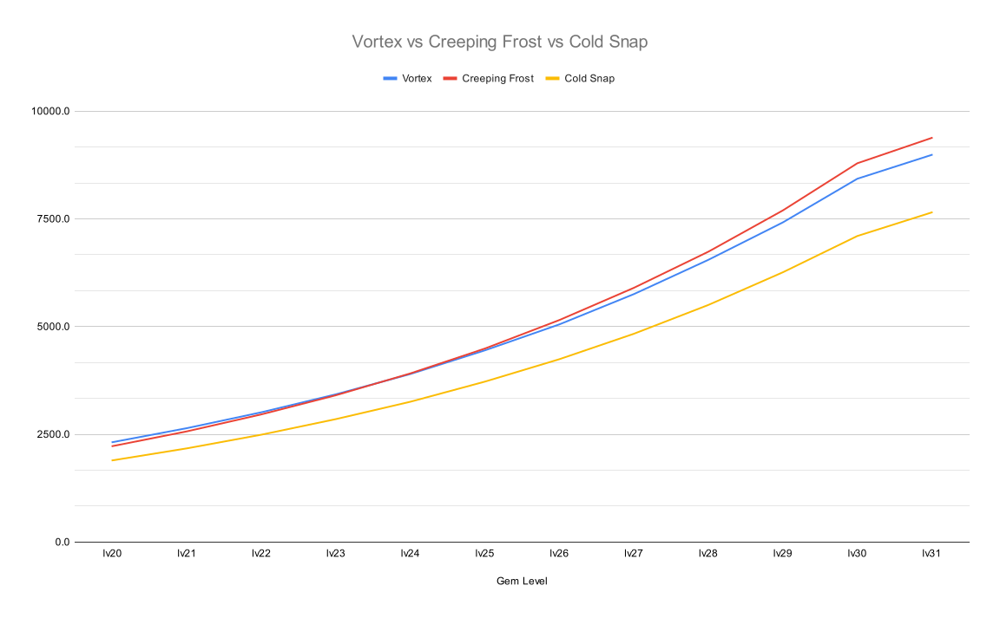
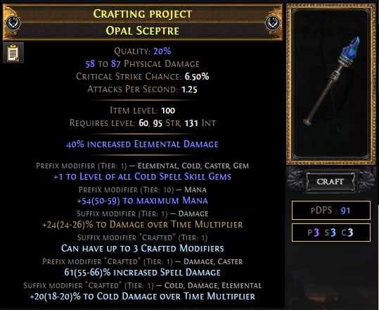

SSFHCでLv100レースで1位になりました！！！

昨年の短期イベント（Endless Heist SSFHC）で、自分が総合1位になったことはありましたが、通常SSFHCリーグでの **正真正銘の総合1位は日本人初** です！！！

Lv100達成直後のtweet↓



- [Lv100時のclip](https://clips.twitch.tv/CutePrettiestStrawberryAMPTropPunch-pqmodmvBc9K8chJG)

Lv100直後のtweetにも書きましたが、3.1のAbyssリーグからSSFHCを初めて約5年で、ようやく1つの大きな目標を達成できました！

特に今回は、よくあるテンプレビルドではなくオリジナルビルド（EB MoM Cold DoT Hierophant）で達成できたことが何よりも嬉しかったです！！！
SSFHCを始めたてのときに、オリジナルビルドでLv100レースを連覇していたAila RFに憧れて必死にLv100を目指していた自分としては、喜びもひとしおです。

---

あまり需要はないかもしれないですが、せっかくの機会なので（もう2ヶ月以上経ってますが）紹介記事を書き残しておこうと思います。

正直、Occ Cold DoTの劣化では？と思うこともないけど、SSFHCのリーグスターターとしては、こっちのほうが向いていると思ってます。

一応、OskarmlnがSSFHCでUber Bossを全Killしてるので、Endgameもいけるはずｗ（ただ、ビルド性能というよりは、人間性能で倒してる感があるので注意ｗ）

- YouTube - All Uber Boss Kill by Oskarmln:
  - https://www.youtube.com/watch?v=X6ZzJ0tPkyY

特にやりたいビルドが思いつかなければ、今週末から始まる[短期イベントのMayhemレース](https://www.pathofexile.com/forum/view-thread/3320180)も、このビルドでいく予定です！対よろー！

前回の[Occultist Poison BFBB Buildの紹介]()と同じフォーマットです。

## 参考にしたPoB、ninja

- Hoowoo - Elementalist Cold DoT
  - [poe.ninja](https://poe.ninja/sentinelhcssf/builds/char/HooWoo/jungroan%E3%86%8Dfan%E3%86%8Dclub%E3%86%8DCEO?i=4&search=class%3DElementalist)
  - Recombinator有りなので、SSFHCにも関わらず、とんでもなくギアが強い
  - 3.18でSSFHCで全てのUber Bossを倒しているビルド
    - VOD: https://www.twitch.tv/videos/1564226674
  - PoB: https://pastebin.com/SVjWnCXD
  - このビルドを参考にHierophantに変えた
- Ryzenier - EB MoM Hierophant Cold DoT
  - [poe.ninja](https://poe.ninja/challengehcssf/builds/char/ryzenier/%E5%93%80%E3%82%8C%E3%81%AA%E3%82%A2%E3%82%AF%E3%83%9E%E3%81%AB%E9%AD%82%E3%81%AE%E6%95%91%E6%B8%88%E3%82%92?i=2&search=class%3DHierophant)
    - 右上の「Time Machine」って書いてあるセレクトボックスから「Day X」の装備が見れます
  - Lake of Kalandra SSFHC Rank1
  - 今期スターターで使用してLv100になったビルド
  - PoB
    - Day1 (Lv90): https://pastebin.com/VJniPCUj
      - 4L: Eater of World撃破
        - PoBではGem Lv19だが、流石にLv20まで上げてから行った
      - 今期は、ドロップ渋い＆アクネメ超強くて19時間でLv90だった
      - いつもより、かなり辛かったorz（この時点で総合5位）
      - 4LでT16もギリギリ回れる
    - Day2 (Lv94): https://pastebin.com/5UAMukBS
      - 5L: +1 Sceptre 2本完成
    - Day3 (Lv96): https://pastebin.com/uDGY8E3i
      - 5L: Catarina頭入手＆Exarch撃破
      - この時点で、装備ほぼほぼ完成
    - Day4 (Lv97): https://pastebin.com/CDfLcYaN
    - Day5 (Lv98): https://pastebin.com/ZAyu37kg
      - 5L: Militant Faith入手＆SceptreをMulti Craft
      - 以降、装備変更なし
    - Day6 (Lv99): https://pastebin.com/k3KcCdWq
    - Day7 (Lv100): https://pastebin.com/9N44eUpQ
- Oskarmln - EB MoM Hierophant Cold DoT
  - 自分のビルドのフォロワー
  - [poe.ninja](https://poe.ninja/challengehcssf/builds/char/Oskarmln/DeadGameExplorer?i=3&search=class%3DHierophant)
  - PoB: https://pastebin.com/r1j7r403
  - SSFHCで全Uber Boss Kill済み
    - ビルドパワーではなく、ほぼほぼプレイヤースキルで倒してる
    - YouTube: https://www.youtube.com/watch?v=X6ZzJ0tPkyY

## メリット・デメリット

- メリット
  - Hierophantのmin EC4のお陰でデフォルトでPhysicalに強く、Resも確保しやすいため、その分、スペサプに回せる。
  - 20% Mana gain ESとEB + MoMにより高いHit Poolを得られる
  - ↑2つにより、盾を持たなくても十分な防御性能がありSceptre 2本持ちできる。DW Leap Slamのため移動速度が早い
    - クラフトもilv2 SceptreにEssenceを打つだけなので超絶簡単
  - inc 25% mana reservation efficiencyにより通常ビルドよりも50% auraを1つ多く貼れる
    - これにより、柔軟なAura選択が可能
    - Map入り直後はPurity of Elementsを貼ることで、スペサプ装備を優先して使用できる
    - MapファームとHeist、Lab周回時はHaste、ボスキル時はHatredにSwap
    - 更に火力が欲しい場合は、GraceをZealotryに変えられる
      - 初回のEldrichボスやTimeless Conflictなど
  - EBにより、Divine BlessingでMalevolenceを使用でき、Cold DoTのMana問題も解決
  - HierophantのArcane BlessingによりEBで有りながらArcane SurgeをProcできる
  - Expedition適正◎
    - 畑がnerfされた今、SSFでギアをこねるには、ExpeditionかEssenceの2択なので、かなりのメリット
    - 絶対に無理なのはCold Immuneのみ。耐久系だと30% reduce damageとLife Reg以外は全て無視できる。ダメージ系は、overwhelm、always crit、can't be evadedを避ければOK。
- デメリット
  - 4つのスキルを場面場面で打ち別ける必要があるため、操作がそこそこ煩雑。このため、ファーム速度がプレイヤースキルに依存する。
    - Vortex: CD 1.8秒、自分中心AoE、Instantスキルのためボス以外左クリックに入れておけばOK
    - Creeping Frost: CD無し、地点指定型AoE（ただしProjectileなので遠くの敵には当てづらい）
    - Cold Snap: CD 3.0秒、地点指定型AoE
    - Vaal Cold Snap: Vaal Skill、自分中心AoEの持続スキル（Cold版RFみたいな感じ）
  - 冗談抜きで、上手い人と下手な人で、ファーム速度が倍は違う
  - ESの回復手段が、Ghost Dance、BeltのVeiled Modのみ（一応Catarina頭でも回復可）
    - このためDoTに対して非常に弱い
    - 100%アボエレにするまで、burning ground対策ができないためMapデバイスでExarch Influenceを選択できない。また、Igniteも非常にキツイのでEnslaver、Exarchに行くときは対策必須。

=> 総じて、SSFのリーグスターター適性が高いが、極まったギアの場合Occの劣化なんじゃないかと思わないでもない。

## Cold DoTビルドに関して

現状、Cold DoTを与えれるスキルは以下の4つのみ（3.19現在）。

- Vortex
- Creeping Frost
- Cold Snap
- Wintertide Brand

スキルを使用すると、範囲内の敵に「①Cold属性のHitダメージ」を与えつつ、Chilled Groundを生成して、その上に載っている敵に「②Cold属性のDoTダメージ」を与える。
Cold DoTビルドでは、「②Cold属性のDoTダメージ」をメインのダメージソースとする。

**Chilled GroundによるDoTダメージは、スキルごとに重複する。**
（Lv21 VortexとLv21 Creeping Frostのダメージは重複するが、Lv21 VortexとLv20 Vortexのダメージは重複しない。この場合、ダメージが高いほうが優先される。）

また、生成されたChilled Groundの上にいる敵は強制的にChill状態になる（ベースのChill Effectは10%）。
Elemental Focusを使用した場合、Hit部分ではChillできなくなるが、Chilled Ground上にいるときは引き続き強制的にChillさせることができる。

- [poewiki.net - Chilled Ground](https://www.poewiki.net/wiki/Chilled_ground)

その他の特徴として、Map ModやExpedition Mod、Eldrich AltarでSpell Suppression Chanceがモンスターに追加されてもDoTダメージは減らない（HitでもDamaging Ailmentsでもないため）。


Wintertide BrandはStack数に応じてDPSが上昇するためCast Speedを稼ぐ必要がある。
このため、CSを必要としない、その他のCold DoTスキルと相性が悪く、現状では、特化ビルド以外では使用されないので、ここでは説明を省く。


各スキルの基本スペックは、以下のとおり。

|                | CD [s] | Duration [s] |
|----------------|-------:|-------------:|
| Vortex         | 1.80   | 3.0          |
| Creeping Frost | -      | 5.0          |
| Cold Snap      | 3.00   | 5.0          |

ダメージ量では、VortexとCreeping Frostが、大体同じぐらいで、Cold Snapは約15-19%ほど低い。
（誤差レベルではあるが、Lv24以降ではCreeping Frost > Vortex）

- [Google Spreadsheet - Cold DoT Skills](https://docs.google.com/spreadsheets/d/e/2PACX-1vQvkobdAagvfOT4bTpwI1e8DEgXU__smuiLZF45er06Lbkokf-gzN2IfYf119PKYBpz4_9BBs5yVJ-A/pubhtml?gid=0&single=true)

どのスキルも、1レベル当たり約12%づつ火力が上昇する。
Lv31以降では、ダメージの伸びが鈍化し1レベル当たり約6%の伸びる。

Cold Snapは、ダメージ量では劣るが、Gem Lvでinc. Chill Effectが上がるためBonechillのproc用として最適。

以上から、火力の高いVortexとCreeping Frostをメインの6Lにセットして5L*2運用しつつ、Cold SnapをBonechill proc用のサブスキルとして使用する。

- よくある質問：5L * 2運用するのはなぜか？
  - Cold DoTは、スキルごとにダメージが重複するので、多くのスキルを使用したほうが、総合したダメージが高くなるため。
  - 6Link目の価値で考えた場合、サポGem一つで得られるのは20～30% more程度だが、Linkを共有する別のスキルを6Link目に入れることで100% more相当になる。

## ダメージの伸ばし方

大まかに優先度順

- All/Cold Gem +1
  - Lv30まではGem Lv1当たり約12%上昇する
- Cold DoT Multi.
- inc. Spell / Elemental / Cold Damage
- inc. Effect of Non-Damaging Ailments
  - Chill Effectを上げることで、Bonechillによりダメージが上がる
  - 靴のEldrich ModのScorch GroundのRes下げ効果も上がる
  - 装備だと、Amuletと靴のVeiled Modと頭のEldrich Modのみなので、余裕があればクラフトする程度でOK
- inc. Effect of Non-Curse Aura
  - 主に防御面での恩恵が大きいが、火力も微量に伸びる
- inc. AoE
  - ダメージには寄与しないが、スキルが当てやすくなるので、なるべく稼ぎたいが、優先度は低め
- inc. Cast Speed
  - Cold SnapのベースCast Timeが0.85と遅いので、稼いでおくと若干プレイフィールが上がるが、基本的には不要

## その他細かい点

### Aura選択

基本は↓のAuraを貼る。

- Determination
- Defiance Banner
- Malevolence w/ Divine Blessing
- Hatred
- Grace
- Vitality: Catarina頭が手に入ったら

その他、要所要所で使うAura。

- Haste: 主にファーム時とLab、HeistでHatredと入れ替え
- Zealotry: 耐久よりも火力が欲しい場面で、Graceとスワップ
- Purity of Elements: リーグスタート時にResに余裕を持たせるために貼る

### Spell Suppression

最終的には、Catarina頭（AR/ES）にするとsuppression masteryの+12%が取得できないので、Inveterateまで伸ばす必要がある。

Treeから、22% (Instinct) + 39% (Inveterate) = 61%稼げるので、残り39%稼ぐ必要がある。
胴、手、靴全てにSuppression必須！

赤マップに入る前には絶対に100%にする。序盤で装備がない場合は、EntrenchをAnointするのが吉！

### アボエレ

Lv100を目指すだけなら不要。

DWのSceptre 2本持ちから盾持ちに変えて、Arcane Sanctuary 25% + 胴25% + 靴50%で合計100%。
胴、手、靴、全てにSuppressionを付ける必要がある。

## Act Run

Act 5を2時間半、Act 10を6時間以内クリアを目標にする（Foothillファーム込み）。

- 参考動画
  - Balaar - 3.18 - Cold Dot Occultist - A10 Pts+Labs - 3h40m14s
    - YouTube: https://www.youtube.com/watch?v=FSVHqvNDyKs
    - リーグの後半はずっとActrunしてる人の動画
    - Witchスタートだが参考になる
    - **概要欄は必読！**

以下、全編解説は大変なのでポイントだけ。

- TemplarだとVolleyが手にはいらないので、RangerでMuleしてMercy Missionまでやる
- Lv10でLeap Slamを買って、Sceptre 2本で進める
- Lv12でCreeping Frost + Onslaught + Volley（DoTではなくOverlapするHit部分がメイン）
  - キチンとFlame Wall越しに当てる
- Lv28でVortexを使用するタイミングで、Clarityを貼る
  - Vortex + Cold Snap + Elemental Focus + (Controlled Destruction or Efficacy or Arcane Surge or Bonechill)
  - Creeping Frost + Onslaught + Volley + Arcane Surge
- Act 4でBonechill、Act 6でHypothemia、Inspirationを買う
- **【超重要】** Act 9 FoothillでInstanceガチャして"Reg. XXX ES while a Rare or Unique Enemy is Nearby"のmodが出るまでSyndicateファームをする
  - これがないとEB MoM型に移行できない
- 3週目のLabをクリアしたらEB MoM型に移行する

### Ascendancy

以下の順番で取得

1. Conviction of Power: min EC + PC
2. Divine Guidance
3. Sanctuary of Thought: 最強！！！
4. Arcane Blessing: Arcane Surge on Hit

### Act5までのPassive振り

### Lv70までのPassive振り

- 3周目のLabをクリアしたらEO周りのポイントをrefundしてEB MoM型に移行する
- この段階でResがキツければ、HatredではなくPurity of Elementsを貼る

この段階で、以下のオーラが貼れる！さいきょー！

- Determination
- Grace
- Hatred or Purity of Elements
- Malevolence w/ Divine Blessing
- Defiance Banner

## クラフト指南

### Sceptre

#### Level 1: +1 Cold Gem + inc. Spell Damage + Cold DoT Multi.

Lv100目指すだけなら、これで十分

- Step 1: 適当なキャラを作って、[Book of Regression](https://www.poewiki.net/wiki/Book_of_Regression)（1 scoring + 1 wisdom）でLv1にして、ilv2のDriftwood Sceptreを買う
- Step 2: +1 Cold Gemが付くまでinc. Spell DamageのEssenceでスパム（成功率: 約1/27）
- Step 3: SuffixにCold DoT Multi.をクラフトする

#### Level 2: +1 Cold Gem + inc. Spell Damage + DoT Multi. + Cold DoT Multi.

今期から、"Empowered Elements"のアクネメmodを持ったmobがFractureアイテムを落とすようになった。
運良くDoT Multi.がFractureされたアイテムを手に入れられたらクラフト可能。

- Step 1: SuffixにDoT Multi.がFractureされたベースを入手する
- Step 2: Prefixに+1 Cold Gemが付くまでAltスパム（成功率: 約1/358）
- Step 3: Regalでレア化。Suffixに追加された場合はAnnulするか、Step 2に戻る。Prefixに追加された場合は、Step 4に。
- Step 4: Multi Craftでinc. Spell DamageとCold DoT Multi.をクラフト

#### Level 3: +2 Gem + inc. Spell Damage + Cold DoT Multi.

今期から、畑の4 modランダムFractureとAdd modが変更されたためSSFでも+2 Gem Sceptreを入手できるようになった。
+1 Physical/Chaos Gemの場合は、後からAdd Physical/Chaosで追加できるのでFractureする必要がないが、Fire、Cold、Lightningは必須。

Fractureするのは、+1 Cold Gemか+1 All Gem。

+1 All Gemの場合は、ベースを用意するのが大変な分、追加でDoT Multi.を付けられる。
+1 Cold Gemは、ベースをベンダークラフトで簡単に用意できる（Normal SceptreとColdタグの付いたGemをQ40以上になるように店売り）

FractureするベースはAll +1を引きやすくするためにilv 55にするか、T3 DoT Multi.がギリギリつくilv 68、高みを目指してilv 82から選択。
ilv 55 or 68のSceptreは、Act 7 or 10のNPCから買うか自分で掘る。

**+1 Cold Gem Fracture ver.**

- Step 1: +1 Cold Gemが付いたSceptreに対して畑のランダムFractureガチャ
- Step 2: Aetheric + Corroded + Metallic + Shudderingで+1 All Gemを引く
  - Aetheric + Corroded + Shudderingでも可
- Step 3: Multi Craftでinc. Spell DamageとCold DoT Multi.をクラフトして完成

**+1 All Gem Fracture ver.**

- Step 1: Aetheric + Corroded + Metallic + Shudderingで+1 All Gemを引いて、畑のランダムFractureガチャ
  - Aetheric + Corroded + Shudderingでも可
- Step 2: Frigid Fossilで+1 Cold GemとDoT Multi.を引く。
  - ilv82以上のベースの場合は、高TierのCold DoT Multi.でも可
- Step 3: Multi Craftでinc. Spell DamageとCold DoT Multi.をクラフトして完成

### Helmet

とりあえず、SuppressionがついていればOK。
EssenceスパムかRogクラフトで作る。

最終は、Catarina頭。Veiled ModはChaos Res複合がベスト。


Catarina頭（AR/ES）ベースにすることでSuppression Masteryの+12%がなくなるので注意！


効率的にCatarinaを湧かす方法は、以下のyamanさんの解説を読めば分かるので必読！！！（なんと日本語！）
今期は、3日目に4回目のCatarinaでドロップした（Lv96時）。

- [Betrayalガイド by yaman](https://docs.google.com/document/d/1SYKsEP1aO4Fx15wjNytW4-MRefCnAZvQaZ9nIMqDih8/edit)

Lv20 Vitalityを追加で貼れるようになる。胴体にEssenceのMana Reservation Efficiencyをつけるか、EnlightenがあればVitalityの代わりに25% Auraを貼ることもできる。

更に、EBを取るための3ptが浮くのもデカい。

### Glove

とりあえず、SuppressionがついてればOK。
EssenceスパムかRogクラフトで作る。

最終的には、Delirium Essenceで30% more DoT + Suppression付きを作る。
SuppressionがFractureされたGloveに対してDelirium Essenceスパムしてから、Suffix Cannot Be ChangedからのVeiled Orbで+2 AoEをつけてLifeクラフトで完成！

- Eater of World: Cold Exposure
- Searing Exarch: Cold DoT Multi.

### Boots

とりあえず、SuppressionがついていればOK。
EssenceスパムかRogクラフトで作る。

最終的には、Loathing EssenceでAvoid Elemental AilmentsとSuppressionが付いたものにSuffix Cannot Be ChangedからのVeiled OrbでPrefixにMSをつけてLifeクラフトで完成！

- Eater of World: Avoid Elemental Ailments
- Searing Exarch: Scorching Ground

### Body Armour

とりあえず、SuppressionがついていればOK

最終はAR/EVベースにSupression + PDRがついたものを用意する。

- Eater of World: Determination / Malevolence / Hatred effect
- Searing Exarch: Non-Curse Aura Effect / Max All Res

### Amulet

Anointは、火力ならAsh, Frost and Storm、耐久ならPrismatic Skin or Soul of Steel。
クラフトは、inc Non-Damaging Ailments Effectがベスト！

#### Level 1: +1 Cold or DoT Multi.付き

とりあえず、+1 ColdかDoT Multi.がついてるものにLifeクラフトすればOK

火力的には、+1 Cold > T1 DoT Multi.

T1 DoT Multi.は、タグなしなのでAltスパムからのRegalで作る。
+1 ColdはReforge ColdかFrigid Fossilでスパムする。

#### Level 2: 最終装備 +2 Gem

畑の改変により、SSFでも+2 Amuletを作れるようになった。

最低でも、8 Divine必要。Step 3で1/2ガチャに失敗するたびに追加で2 Divineかかる。

- Step 1: Suffixに有用modがfractureされているものに対してAltスパムで+1 all gemを引く
- Step 2: Regalでmod追加。PrefixならAnnulガチャ、SuffixならStep 3へ
- Step 3: Prefix Cannot Be ChangedからのAnnulガチャで2 modレアにする
- Step 4: Multi Craft + Prefix Cannot Be Changed + Add Cold Damage to Attackをクラフトして畑のAdd Coldで確定で+1 Coldが付く
- Step 5: Multi CraftでLifeとNon-Damaging Ailments Effectをクラフトして完成

fracture modは、DoT Multi.がベストだが、SSFだと難しいのでRes、Dex、Strあたりでも可！

Step 1のAltスパムは、かなりの沼なので2k Altは考えておくこと！

沼っている例↓



### Ring

ベースは基本Amethyst Ring、その他の部位で十分にChaos Resが稼げていればVermillion Ringもあり。

Mana Regが必要ないので、Cannot Be Changed SuffixからのVeiled OrbはやらなくてOK

Dexが44足りないので、片方はDex Essenceをスパムする！

もう片方は、何でもOK。強いて言うなら、Delirium EssenceでDoT Multi.付きがクラフトできると良い。

### Shield

アボエレにする場合は必要。

ここでAvoid Elemental AilmentsやSupressionを盛ってもいいが、inc. Spell or Cold Damageが付いたものに畑のAdd Coldで+1 Cold Gemを付けたものを用意したい。

ファーム速度は圧倒的にDW Leap Slam > Shield Charge。

## 総評

- SSFHC Rank 1になった思い出深いビルド
- 資産ゼロの状態から安定してLv100まで一気にいける
- PS依存度は高いが、ファームもそこまで遅くない

---

## 余談

ここからは完全に余談。

本当は「SSFHC Rank1流：リーグスタートの進め方」っていう別記事にするつもりだったけど、めんどくなったので、ここに書き残しておく。

今週末の短期リーグや、来期のスタート時の目安になれば程度。

### ビルド決め：リーグスターターに求める条件

まず、直近の数リーグで、自分がSSFHCのスターターを決める目安は↓

「**①5Link**で、**②クエスト版のEater of Worldを倒す**ことができ、**③T14+を安定して回れる**」

一つ一つ見ていくと、

- **①5Link**
  - サポgem nerfのお陰で以前よりも6Link目の価値（=20～30% more）が下がっている
  - SSFではcorrupt 6Lも手に入りづらく、万一手に入ったとしても今期からスペサプ100にするには、胴体にスペサプが、ほぼほぼ必須なため6Lは考えないほうがいい。
    - 優先順位としては、「スペサプ有り6L > スペサプ有り5L > スペサプ無し6L > スペサプ有り4L > コラプト6L > 5L > 4L > 白シャツ」
  - 実際に今回Lv100にしたキャラは最後まで、スペサプ有り5L。
- **②クエスト版のEater of Worldを倒す**
  - Void Stoneが入手できるし、何よりMapをInfluence化して回せるようになる（リーグ開始直後のCurrencyカツカツのときにはBasic CurrencyのAltarですら美味い :yum: ）
  - 今期は、Gem Lv20で4Lのときに倒した（525k = 4L: Creeping Frost 260k + 3L: Vortex 145k + 3L: Cold Snap 120k）
  - 前座の中ボスはGem Lv19のLv87-89ぐらいで倒す。
- **③T14+を安定して回れる**
  - T14+なのは、Eldrich BossのInvitationが進む、ガーディアンマップが手に入る、Jun Missionで得られる経験値量が多いと、メリットが多いため
  - Mapが安定してきたら、当然T16しか回さない
  - 回すのは、ダメージmodなしの2 modのmagic！！！
    - **HCの場合、レアで回す必要は一切ない！** 自分が、レアで回すのは、リーグ開始直後にT11→T16にTierを上げていてCurrencyに十分な余裕があるときと、ビルドが100%完成してガーディアンマップを回すときだけ。通常のマップファームはMagicのみ。

本来なら、この後に、SSFHCでの効率的なMapのTierの上げ方、Atlas Passiveの振り方、その他細かいTipsを書くつもりだったorz
後々、気合があれば、あれば書くかも（多分、書かない）。
