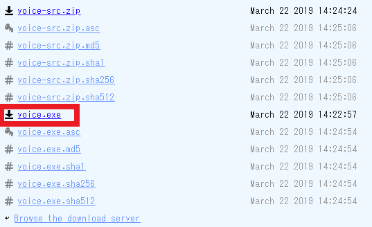

独自のサウンドを作る方法は、オンラインのサイトを使う方法もありますが、それだと遅いので、ここでは `voice.exe` を使った方法を紹介します。

## 1. `voice.exe` をダウンロード

下記のページにアクセスして「`voice.exe`」をダウンロードして好きなフォルダに入れます。

- https://www.elifulkerson.com/projects/commandline-text-to-speech.php




## 2. コマンドプロンプトからコマンドを実行する

コマンドプロンプトを起動して `voice.exe` をダウンロードしたフォルダに移動します。

※やり方がわからない場合は「 `コマンドプロンプト フォルダ 移動` 」等でググってください。

移動したら↓のコマンドをコピペして、実行すると `voice.exe` と同じフォルダに `trans.wav` というファイルができます。

```
voice -n "Microsoft Zira Desktop" -o trans.wav trans
```

後は、いつもどおり「 `C:\Users\ryzenier\Documents\My Games\Path of Exile` 」に `trans.wav` を置いて完了です。


今回は例として「 `trans` 」にしましたが「 `blue blue green` 」のように複数単語にしたい場合は、↓のようにすることで、作成できます。

```
voice -n "Microsoft Zira Desktop" -o bbg.wav blue blue green
```
